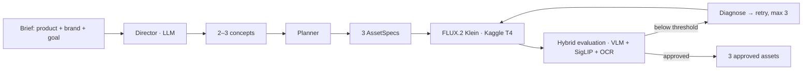
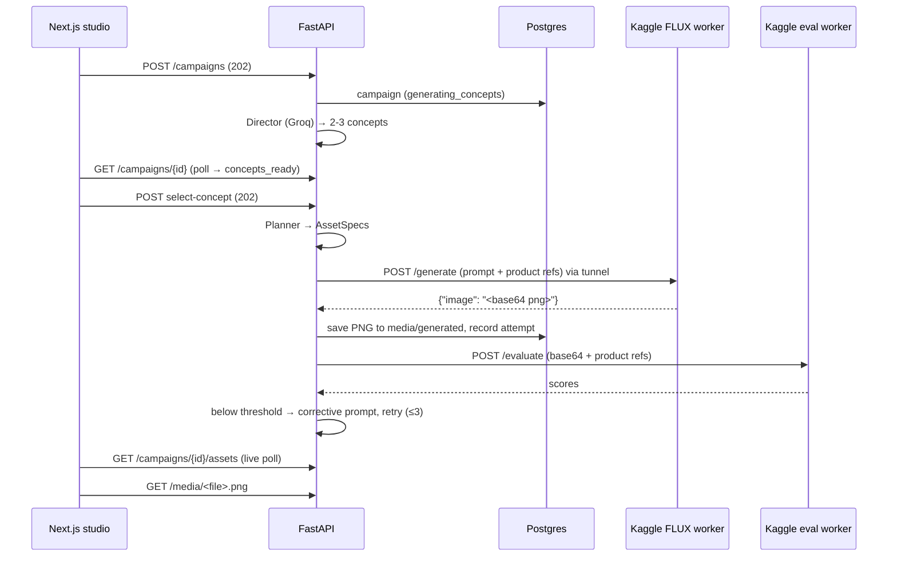

# CIBA — Agentic Creative Campaign Engine

One product shot. One brief. A whole *campaign* — not just another image.

CIBA turns a **product + brand + campaign brief** into a complete multi-channel ad campaign: it directs the concepts, plans per-channel compositions, generates from your real product imagery, evaluates its own output, and automatically re-runs anything below standard — then hands you 3 approved assets.

This is a portfolio project built around clean, provider-abstracted architecture — not a `prompt -> image` toy.

---

## The pipeline



- **Director** — an LLM (Groq by default, Gemini swappable) reads the brief and produces 2–3 distinct creative concepts: visual DNA (palette, lighting, environment, mood), ad copy, and rationale.
- **Planner** — recomposes the selected concept into 3 genuinely different placements (not crops):

  | Placement | Ratio | Size |
  |---|---|---|
  | Instagram Feed | 4:5 | 1080×1350 |
  | Instagram Story | 9:16 | 1080×1920 |
  | Website Hero | 16:9 | 1920×1080 |

- **Generation** — FLUX.2 Klein (4B) on a free Kaggle T4, reference-conditioned on your real product image, rendered **text-free** so copy is overlaid in post-production.
- **Evaluation** — a hybrid VLM + SigLIP + OCR engine scores product fidelity, brand consistency, composition, and alignment. Below threshold → a corrective instruction feeds the next attempt (max 3 per asset). Every attempt + evaluation is stored — never overwritten.

---

## Architecture

Three deliberate decisions make the interview story clean:

1. **Provider-abstracted execution** — generation and vision scoring live behind `ImageGenerationProvider` / `VisionEvaluator` interfaces. Swap providers by env var: `mock` ↔ `flux2_klein_kaggle` ↔ `gemini`.
2. **Async `202 → poll` contract** — nothing waits on generation. `POST` returns `202`, background tasks run, clients poll `GET`. Kafka can slot in later without touching the frontend.
3. **Stored attempt history** — the UI literally shows the system improving its own output across attempts.



---

## Stack

- **Backend** — FastAPI, SQLAlchemy 2.0 (async), PostgreSQL 16, Alembic, LangGraph, python-jose (HS256), pydantic-settings
- **Frontend** — Next.js 16 (App Router), NextAuth v4 (Google), custom HS256 JWS so FastAPI can verify the same token
- **Generation** — FLUX.2 Klein 4B (diffusers) on a Kaggle T4 worker, exposed over ngrok/cloudflared
- **Evaluation** — SmolVLM2 + SigLIP + RapidOCR on a second Kaggle worker (or Gemini VLM + local SigLIP/OCR)
- **Director LLM** — Groq `llama-3.3-70b-versatile` (default) | Gemini Flash

## Repo layout

```
app/            FastAPI backend (config, models, auth, graph, evaluation, routes, main)
alembic/        schema migration (initial_schema)
frontend/       Next.js app — landing page + auth-gated studio
notebooks/      Kaggle workers (FLUX gen + hybrid eval) + setup notebooks
datasets/       Kaggle-upload copies of the workers (single source of truth: notebooks/)
tests/          pytest suite (20 tests, mock providers)
```

## Getting started

### 1. Postgres

```bash
docker compose up -d
```

### 2. Backend

```bash
python -m venv .venv && . .venv/bin/activate   # Windows: .venv\Scripts\activate
pip install -e .
alembic upgrade head
uvicorn app.main:app --reload --port 8000
```

### 3. Frontend

```bash
cd frontend
npm install
npm run dev        # http://localhost:3000
```

Configure Google OAuth (NextAuth) in `frontend/.env.local` and share `NEXTAUTH_SECRET` with the backend.

### 4. Kaggle workers (real generation/eval)

Run the two Kaggle notebooks (`notebooks/notebook_test.ipynb` for FLUX, `notebooks/eval_worker_test.ipynb` for eval), then put the ngrok URLs in `.env`:

```bash
KAGGLE_GATEWAY_URL=https://<gen-worker>.ngrok-free.app
KAGGLE_EVAL_GATEWAY_URL=https://<eval-worker>.ngrok-free.app
```

With `IMAGE_GENERATION_PROVIDER=mock` and `VISION_EVALUATOR_PROVIDER=mock` the whole flow runs with no external services.

## Configuration (`.env`)

| Variable | Default | Purpose |
|---|---|---|
| `LLM_PROVIDER` | `groq` | Director LLM: `groq` \| `gemini` |
| `GROQ_API_KEY` / `GROQ_MODEL` | — / `llama-3.3-70b-versatile` | Groq credentials + model |
| `IMAGE_GENERATION_PROVIDER` | `mock` | `mock` \| `flux2_klein_kaggle` \| `gemini` |
| `KAGGLE_GATEWAY_URL` | — | FLUX worker tunnel |
| `VISION_EVALUATOR_PROVIDER` | `mock` | `mock` \| `hybrid` |
| `VLM_PROVIDER` | `kaggle` | eval backend: `kaggle` \| `gemini` |
| `KAGGLE_EVAL_GATEWAY_URL` | — | eval worker tunnel |
| `GENERATE_PLACEMENTS` | `all` | `all` or subset like `ig_feed` (faster testing) |
| `SQL_ECHO` | `false` | echo SQL queries |

## Testing

```bash
python -m pytest      # 20 tests, all mock providers
```

## Project status

All 5 checkpoints implemented and validated: foundation + auth + CRUD, Director loop (Groq), real FLUX generation on Kaggle, live hybrid evaluation with retry loop, and the Next.js studio + landing page.

## Out of scope (V1)

Qdrant/vector retrieval, Kafka, Kubernetes/KEDA, S3/MinIO, observability, channel-picker UI, billing/teams/multi-brand permissions.
